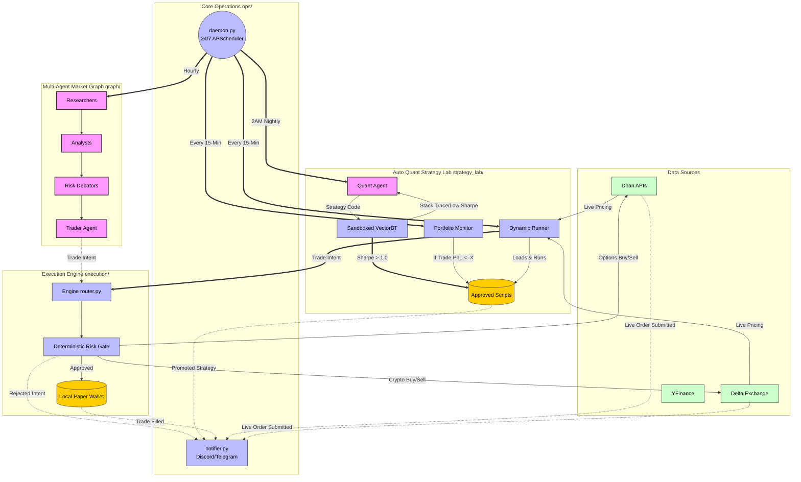

# TradingAgents Architecture Overview

## The Multi-Agent System (LangGraph)
TradingAgents operates on a robust multi-agent graph architecture designed to isolate responsibilities:
- **Researchers**: Retrieve raw data (fundamentals, options chains, crypto derivatives) from Dhan, Delta, Alpha Vantage, and YFinance.
- **Analysts**: Synthesize the retrieved data into cohesive outlooks (Market Analyst, Fundamental Analyst).
- **Debators (Risk Mgmt)**: Challenge the generated hypotheses for flaws and extreme risk-taking.
- **QuantAgent**: Specialized in generating pure `vectorbt` backtesting scripts iteratively based on market conditions.
- **Trader**: Finalizes the discrete parameters of the asset to be bought or sold.

## System Topology
1. `graph/`: Orchestrates the flow of states between LLM nodes.
2. `strategy_lab/`: Handles sandboxing the code generated by `QuantAgent`, executing the `vectorbt` strategies, and promoting successful outputs to the `approved_scripts/` repository.
3. `execution/`: A resilient, deterministic engine that routes intents to live brokerages (Dhan / Delta) or the Local Paper Wallet. It manages Risk Gates and prevents duplicate executions.
4. `ops/`: Contains 24/7 lifecycle handlers like `daemon.py` which schedules operations, and `notifier.py` which alerts external messaging layers.

## The Life of a Trade
1. **Cron Trigger**: `daemon.py` wakes up the `TradingAgentsGraph`.
2. **Analysis**: Data flows from Providers -> Analysts -> Trader node.
3. **Intent Generation**: Yields a `TradeIntent`.
4. **Execution Gate**: Passes through `DeterministicRiskGate` and `ExecutionIdempotencyManager`.
5. **Broker Routing**: Executes on Dhan (Options), Delta (Crypto), or Paper (Simulation).
6. **Notification**: The event is journaled and sent via Webhook to Discord/Telegram.
## System Diagram (Mermaid)

